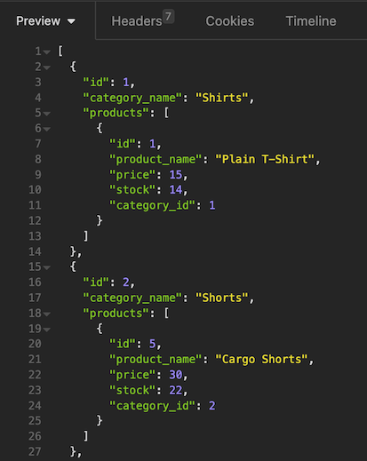

# E-commerce Back End

 
## Description

This is the back end for an e-commerce site. I was given a working Express.js API and configured it to use Sequelize to interact with a MySQL database.

- Data models were essential to know what to input when testing the routes
- Writing the routes was repetative and helped commit the try/catch statements to memory.
- With this project I discovered the difference between a status code 200 and 201 (OK vs Created)

## Usage

The routes can be tested with Insomnia. Here is a screenshot of what the Category data looks like from a GET request:

[Video Demo](https://drive.google.com/file/d/1QB1JQu9jx1CndNipVr6Gkwz0pq3Qs6z9/view)

## License

MIT License

Copyright (c) 2023 Kate Rogers

Permission is hereby granted, free of charge, to any person obtaining a copy
of this software and associated documentation files (the "Software"), to deal
in the Software without restriction, including without limitation the rights
to use, copy, modify, merge, publish, distribute, sublicense, and/or sell
copies of the Software, and to permit persons to whom the Software is
furnished to do so, subject to the following conditions:

The above copyright notice and this permission notice shall be included in all
copies or substantial portions of the Software.

THE SOFTWARE IS PROVIDED "AS IS", WITHOUT WARRANTY OF ANY KIND, EXPRESS OR
IMPLIED, INCLUDING BUT NOT LIMITED TO THE WARRANTIES OF MERCHANTABILITY,
FITNESS FOR A PARTICULAR PURPOSE AND NONINFRINGEMENT. IN NO EVENT SHALL THE
AUTHORS OR COPYRIGHT HOLDERS BE LIABLE FOR ANY CLAIM, DAMAGES OR OTHER
LIABILITY, WHETHER IN AN ACTION OF CONTRACT, TORT OR OTHERWISE, ARISING FROM,
OUT OF OR IN CONNECTION WITH THE SOFTWARE OR THE USE OR OTHER DEALINGS IN THE
SOFTWARE.